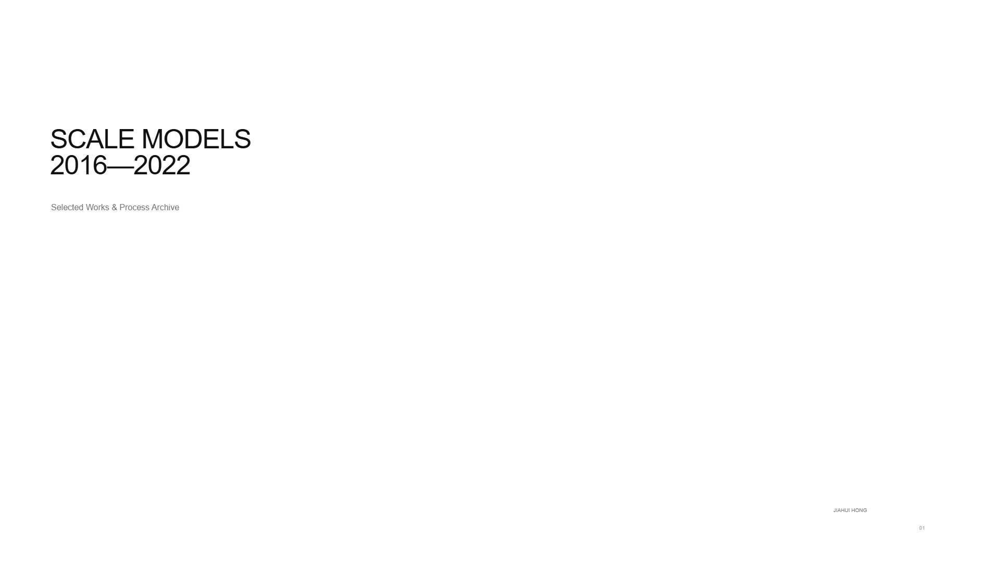
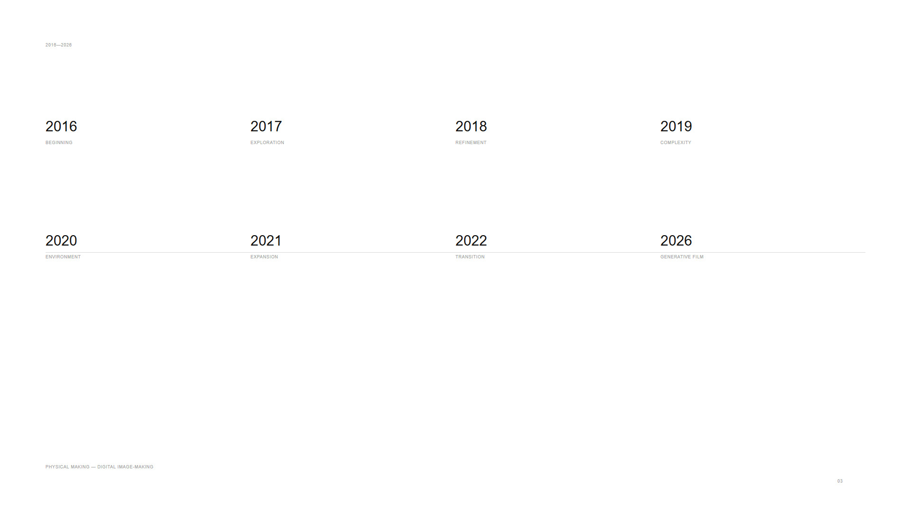
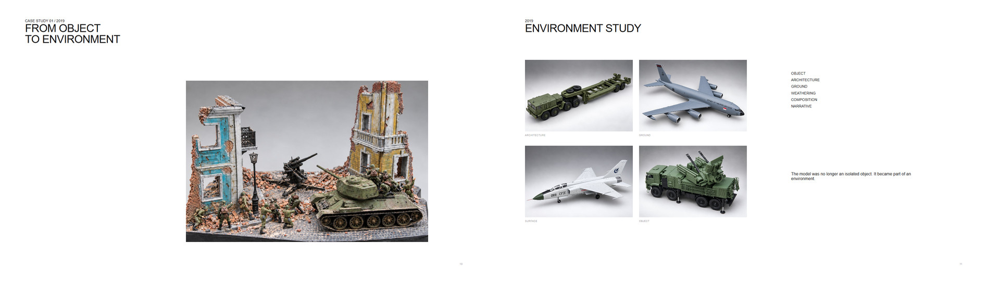
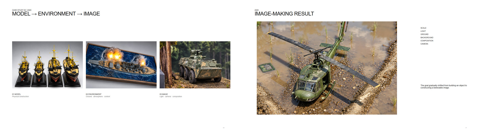
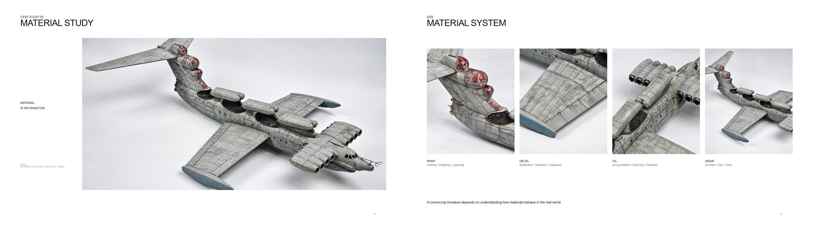
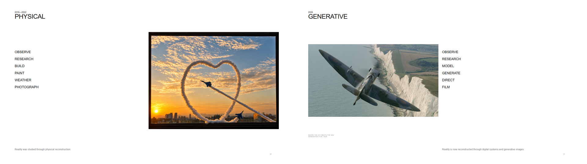

# SCALE MODELS — 2016—2022

### Selected Works & Process Archive

*关于制作、观察与材质研究的七年视觉档案。*

## 项目概述｜Overview

**在学会创造之前，我先学会了观察。**

大约从 16 岁开始，比例模型成为我第一次系统研究真实物体的方式。

从比例、结构和材质，到颜色、旧化、历史资料与环境关系，每一次制作都需要先理解真实世界中的对象，再尝试通过实体模型将它重新构建出来。

最初只是一个兴趣。

但在持续七年的制作过程中，它逐渐成为了一种观察和理解事物的方法，也影响了后来我对摄影、3D、Image-making 与 Generative Film 的理解。

**2016—2022 · 7 Years · 148 Photographs**

---

## 七年制作档案｜Seven Years of Making

**2016** — Beginning  
**2017** — Exploration  
**2018** — Refinement  
**2019** — Complexity  
**2020** — Environment  
**2021** — Expansion  
**2022** — Transition

从最初关注一个模型是否被准确地制作出来，到逐渐开始研究材质、环境、光线、摄影与画面构成，这七年的实践慢慢从单纯的 **Object Making** 延伸到了 **Image-making**。

---

## 从物体到环境｜From Object to Environment

### 2019 — Environment Study

模型不再只是一个孤立的物体。

随着 Diorama 与场景制作的加入，我开始思考物体与建筑、地面、环境以及画面之间的关系。

如何让墙面的破损、地面的痕迹、模型的 Weathering 和周围环境属于同一个世界，也逐渐成为制作过程的一部分。

`OBJECT` `ARCHITECTURE` `GROUND` `WEATHERING` `COMPOSITION` `NARRATIVE`

---

## 从模型到画面｜From Model to Image

### 2020 — Image-making

**MODEL → ENVIRONMENT → IMAGE**

到 2020 年，我关注的重点开始进一步发生变化。

目标不再只是完成一个模型，而是尝试利用真实环境、地面、背景、自然光和摄影构图，让一个微缩物体最终形成具有可信空间关系的画面。

模型开始成为 Image-making 的一部分。

`SCALE` `LIGHT` `GROUND` `BACKGROUND` `COMPOSITION` `CAMERA`

---

## 材质即信息｜Material Is Information

### 2021 — Material Study

真实感并不只来自模型本身的精度。

油漆如何褪色、金属如何暴露、油污如何沿结构积累、不同位置为什么产生不同程度的磨损——这些细节背后都有真实世界中的材料逻辑。

因此，Weathering 对我而言逐渐不只是“做旧”，而是在通过表面状态重新表达材料、使用方式与时间。

**PAINT**  
Fading · Chipping · Layering

**METAL**  
Reflection · Variation · Exposure

**OIL**  
Accumulation · Direction · Residue

**WEAR**  
Contact · Use · Time

---

## 从实体到生成式影像｜Physical → Generative

### 2016—2022 / PHYSICAL

`OBSERVE → RESEARCH → BUILD → PAINT → WEATHER → PHOTOGRAPH`

过去，我通过实体制作重新构建现实。

### 2026 / GENERATIVE

`OBSERVE → RESEARCH → MODEL → GENERATE → DIRECT → FILM`

今天，媒介逐渐变成 3D、Generative Image 与 Generative Film。

制作方式发生了变化，但很多工作依然从同一个地方开始：

**观察真实世界，查找资料，理解对象，然后重新构建它。**

> **The tools changed.  
> The way I observe things didn't.**

---

## 完整作品集｜Full Portfolio

完整项目收录了 **2016—2022 年间的 148 张照片**，并整理为一套 **32-page Visual Archive & Case Study**。

- [查看完整 PDF](exports/pdf/SCALE_MODELS_2016_2022.pdf)

---

## 项目信息｜Project Information

**项目｜Project**  
Scale Models 2016—2022

**类型｜Type**  
Personal Archive / Visual Research / Material Study

**时间｜Period**  
2016—2022

**档案｜Archive**  
148 Photographs

**制作与整理｜Design & Archive**  
Jiahui Hong

---

*The tools changed. The way I observe things didn't.*
